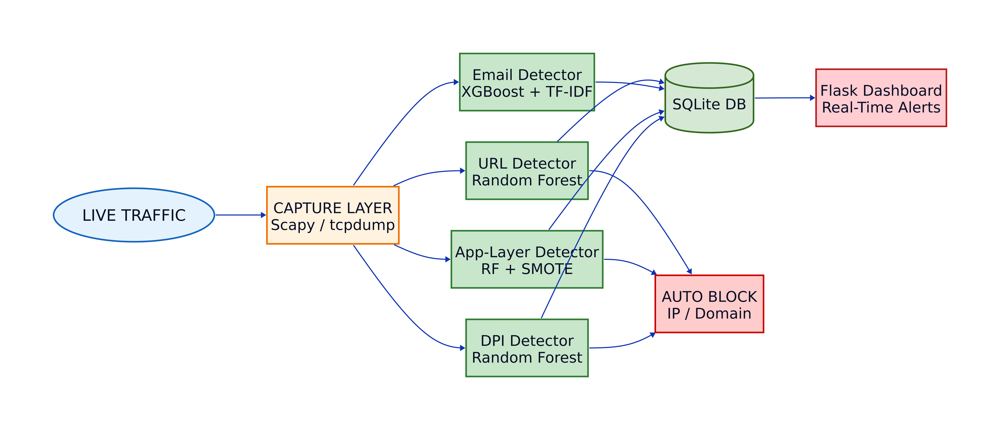
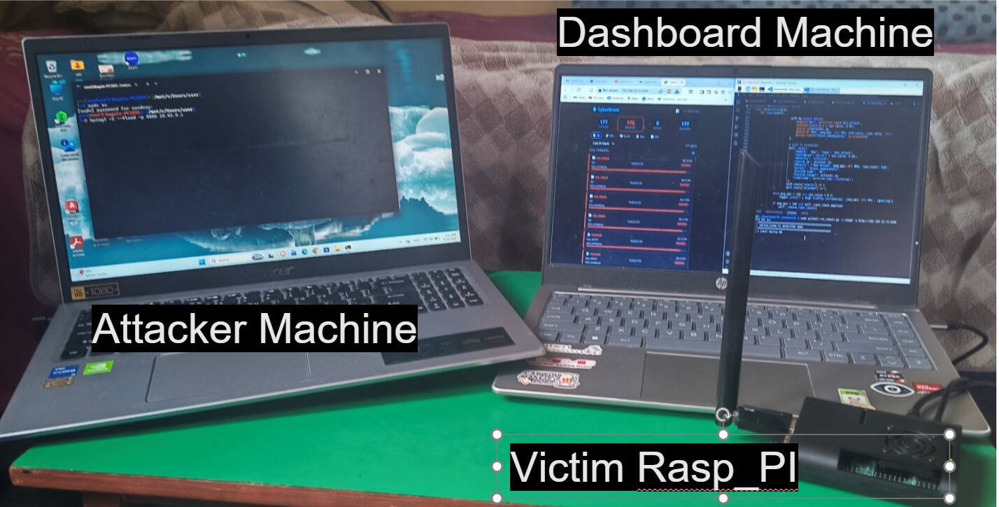
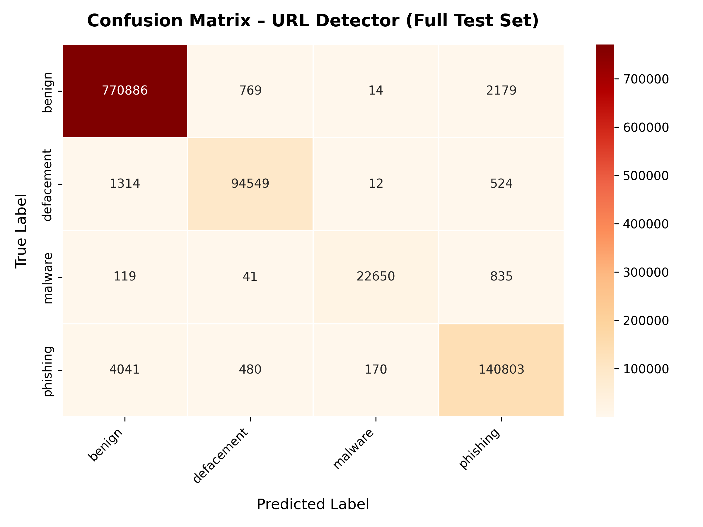
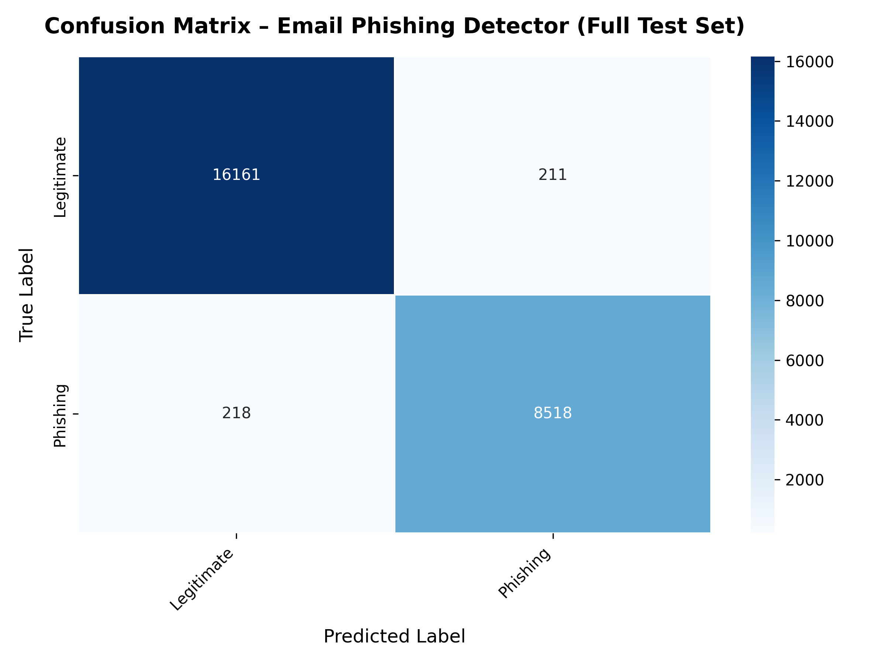
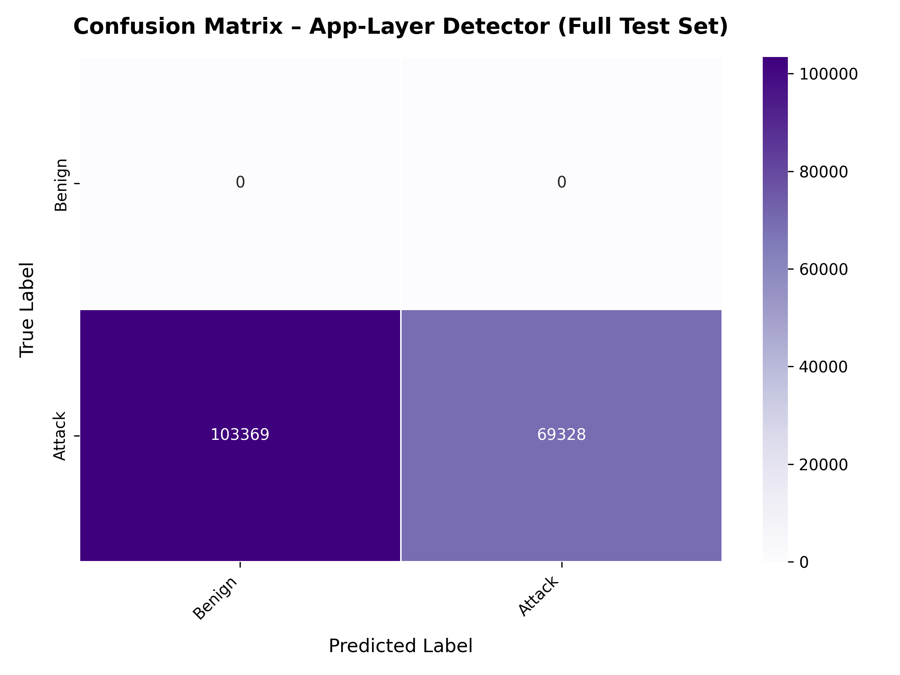
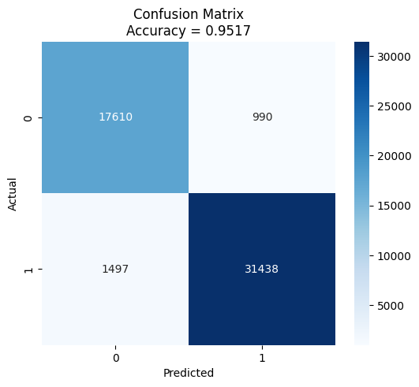
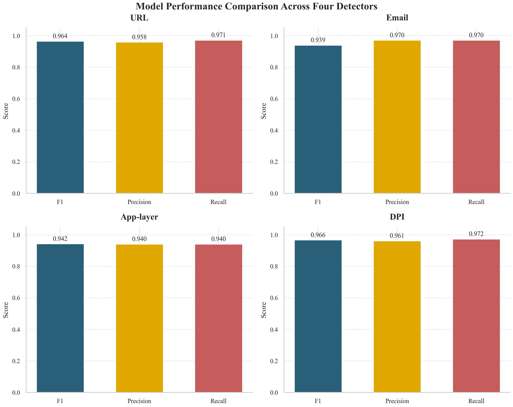
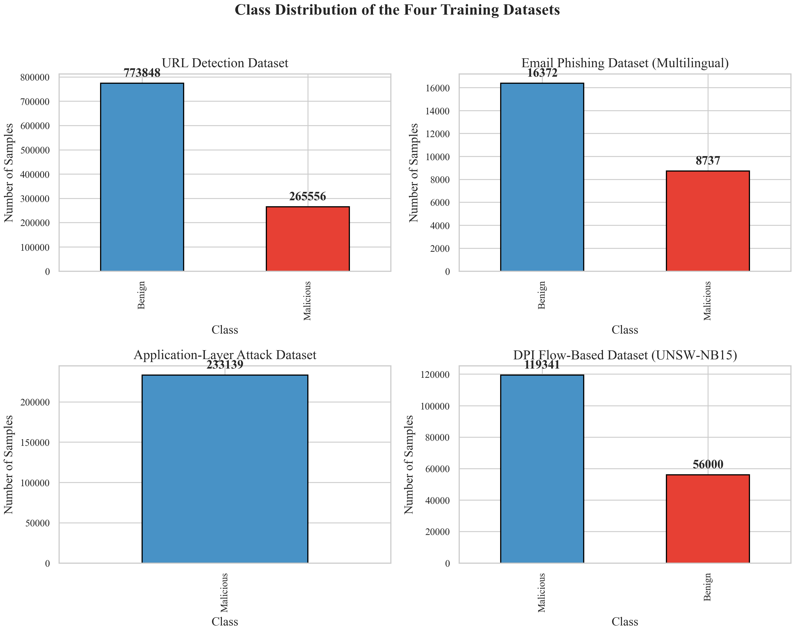
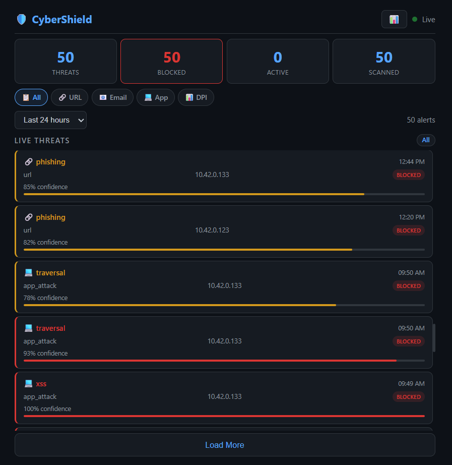

# 🛡️ Multi-Lingual Cyber Threat Prevention System using Machine Learning on Edge Devices

---

## 🚀 Project Highlights

A lightweight AI-powered cybersecurity platform that performs **real-time threat detection on Raspberry Pi 5** using machine learning models optimized for edge deployment.

### Key Achievements

* ✅ Designed and deployed a complete edge-based cyber threat detection system
* ✅ Supports multilingual phishing detection in **English, Nepali (Devanagari), and Hindi**
* ✅ Reduced phishing detection model size from **700 MB (mBERT)** to **1.3 MB (XGBoost)**
* ✅ Reduced inference latency from **70 ms** to **5 ms per email**
* ✅ Achieved **F1 Score = 0.94** on multilingual phishing classification
* ✅ Processes network traffic and application-layer attacks in real time
* ✅ End-to-end alert latency ≈ **120 ms**
* ✅ Successfully deployed on Raspberry Pi 5

---

## 📌 Overview

Traditional Intrusion Detection Systems (IDS), Deep Packet Inspection (DPI) solutions, and phishing detectors are typically designed for English-language environments and often require powerful hardware resources.

This project addresses two key challenges:

### 🌐 Multilingual Threat Detection

Most phishing detection systems struggle with underrepresented languages such as Nepali written in Devanagari script. This system extends detection capabilities beyond English by supporting:

* English
* Nepali (Devanagari)
* Hindi

### ⚡ Edge Deployment

Instead of relying on expensive cloud infrastructure, the system is optimized to run on low-cost edge hardware while maintaining strong detection performance and low latency.

---

## 🏗️ System Architecture

The platform consists of four independent machine learning engines running in parallel:

| Module                      | Algorithm                      | Purpose                                                                |
| --------------------------- | ------------------------------ | ---------------------------------------------------------------------- |
| Flow-Based DPI              | Random Forest Pipeline         | Detect network anomalies, beaconing, C2 traffic, DoS, and exfiltration |
| URL Scanner                 | Random Forest (200 Trees)      | Detect phishing, malware, defacement, and benign URLs                  |
| Application Attack Detector | TF-IDF + Random Forest + SMOTE | Detect SQLi, XSS, SSTI, Path Traversal, Command Injection              |
| Email Phishing Detector     | TF-IDF + XGBoost               | Detect multilingual phishing emails                                    |

### Pipeline Flow

1. Traffic Capture (Scapy / tcpdump)
2. Feature Extraction
3. Parallel Threat Detection
4. SQLite Alert Storage
5. Real-Time Dashboard Visualization

---

## 📸 Real-World Deployment

**Raspberry Pi 5 running the complete detection pipeline with live traffic capture and dashboard monitoring.**

---

## 🎯 Performance Summary

| Module             | Precision | Recall | F1 Score | Inference Time |
| ------------------ | --------- | ------ | -------- | -------------- |
| URL Detector       | 0.96      | 0.96   | 0.964    | 2 ms           |
| Email Detector     | 0.94      | 0.94   | 0.940    | 5 ms           |
| App-Layer Detector | 0.98      | 0.97   | 0.980    | 3 ms           |
| Flow-Based DPI     | 0.97      | 0.95   | 0.966    | 8 ms           |

### System Performance

| Metric               | Value   |
| -------------------- | ------- |
| End-to-End Latency   | ~120 ms |
| CPU Usage @ 100 Mbps | <40%    |
| Memory Usage         | ~800 MB |
| Total Model Size     | ~470 MB |

---

## 📊 Model Evaluation

| URL Detector                                                   | Email Detector                                                     | App-Layer Detector                                             | DPI Detector                                                   |
| -------------------------------------------------------------- | ------------------------------------------------------------------ | -------------------------------------------------------------- | -------------------------------------------------------------- |
|  |  |  |  |

These results demonstrate strong classification performance across network traffic analysis, phishing detection, malicious URL classification, and web application attack detection.

---

## 📈 Performance Comparison

---

## 📂 Dataset Distribution

| Model                      | Dataset                       |
| -------------------------- | ----------------------------- |
| Flow-Based DPI             | UNSW-NB15                     |
| URL Detection              | URLsdata.csv                  |
| App-Layer Attack Detection | CSIC 2010 + Synthetic Attacks |
| Phishing Email Detection   | Multilingual Email Corpus     |

---

## 🖥️ Real-Time Dashboard

### Dashboard Features

* Live threat monitoring
* Real-time alert feed
* Threat categorization
* Historical attack analytics
* Interactive filtering
* Payload inspection
* Confidence score tracking

---

## 🔬 Skills Demonstrated

### Machine Learning

* Random Forest
* XGBoost
* TF-IDF
* Feature Engineering
* Imbalanced Learning (SMOTE)

### Cybersecurity

* Deep Packet Inspection
* Intrusion Detection
* Phishing Detection
* Web Application Security
* Threat Intelligence

### MLOps & Systems

* Edge AI Deployment
* Raspberry Pi Optimization
* Model Serialization
* Real-Time Inference Pipelines
* Monitoring Dashboards

### Software Engineering

* Python
* Flask
* Socket.IO
* SQLite
* Scapy
* Data Pipelines
